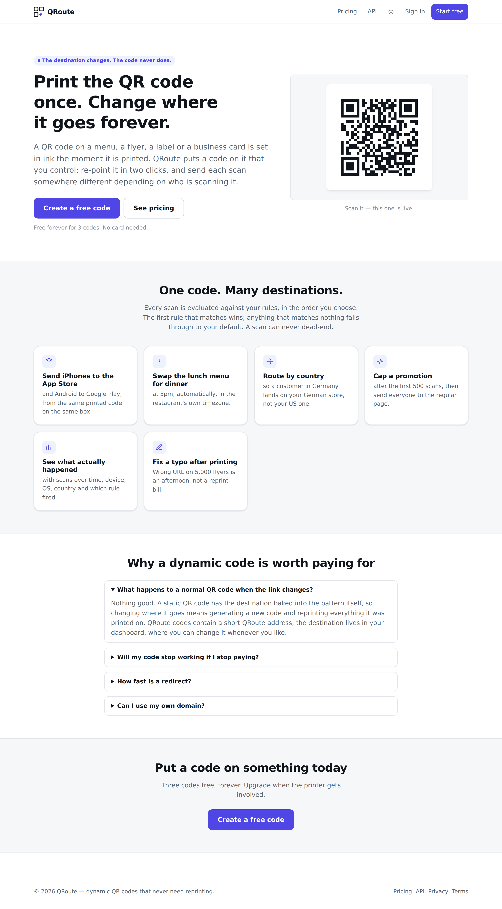
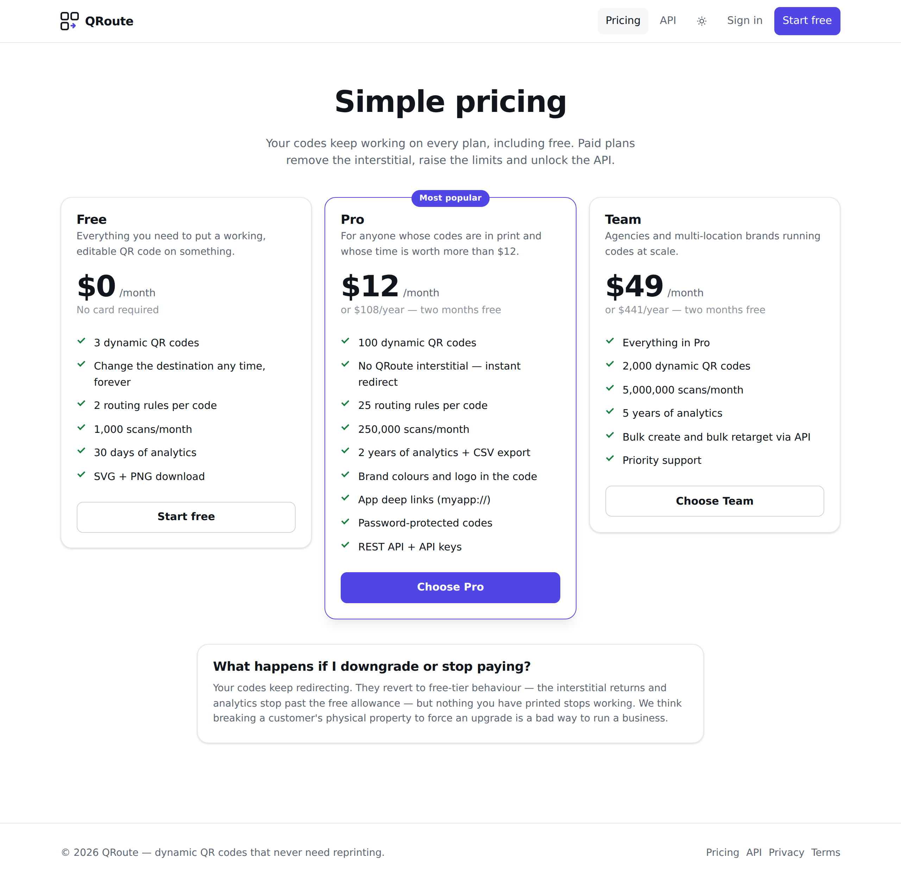
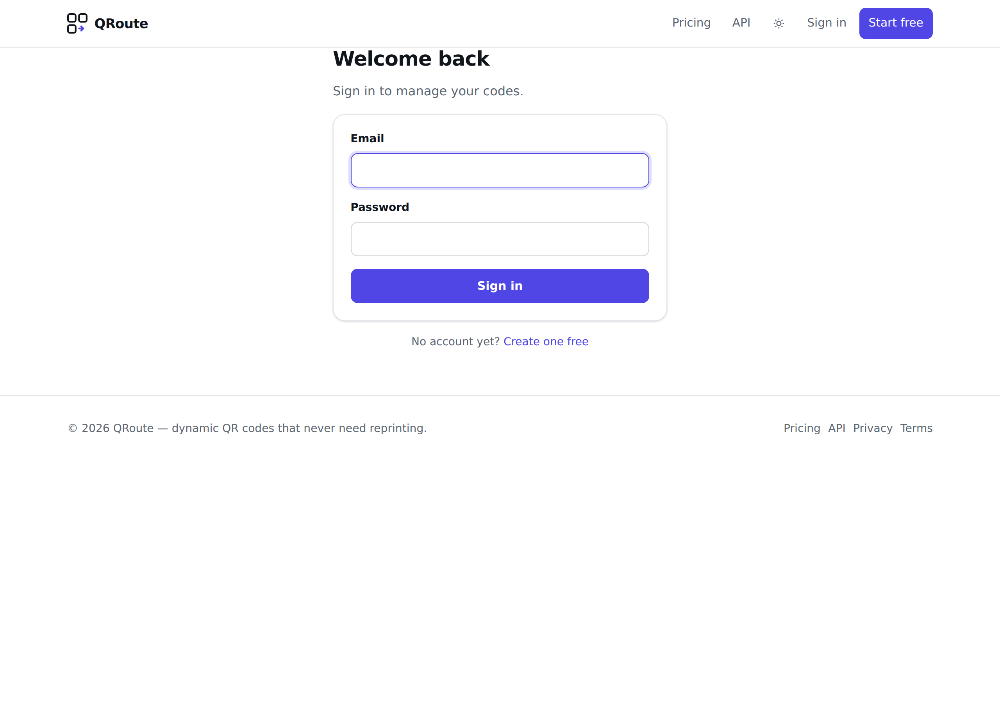
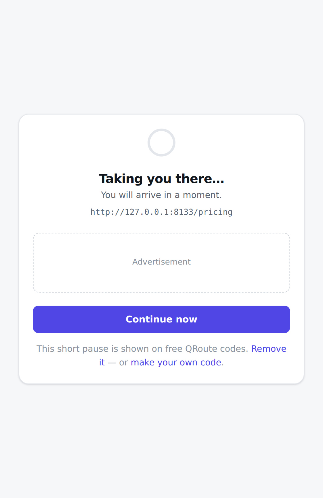
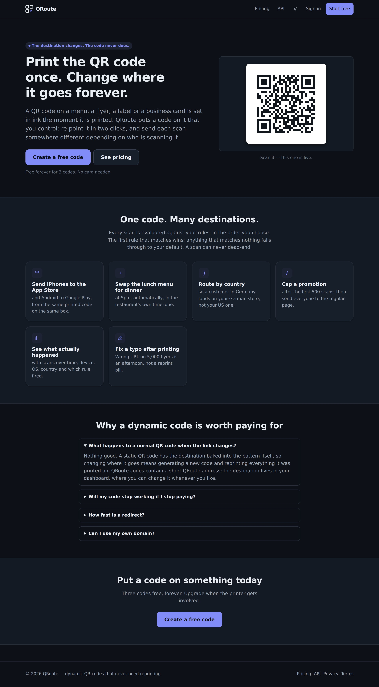

# QRoute

**Dynamic QR codes with a routing engine.** Print a code once; change where it
goes forever, and send each scan somewhere different depending on who is
scanning it.

No framework, no Composer dependencies, no build step. It runs on a stock
PHP 8.2+ install with **MySQL or MariaDB**, so XAMPP, MAMP, Laragon or any
shared host works out of the box. SQLite is supported by the same migrations
if you ever want a deployment with no database server, but nothing requires
it.

---

## Why this is a business and not a toy

A QR code printed on a menu, a flyer, a product label or a business card has
its destination **baked into the pattern**. Change the URL and every printed
copy is dead paper.

QRoute codes encode a short QRoute address instead. The destination lives in
the database, so it changes in two clicks. That single fact drives the whole
commercial model:

- **Retention is physical.** A customer with 5,000 printed flyers cannot leave
  without a reprint. Churn on a dynamic-QR product is structurally low in a way
  most SaaS can only envy.
- **Three revenue levers, already built.** A free-tier interstitial with an ad
  slot; a Pro plan that removes it and raises limits; an API for agencies
  managing codes at volume.
- **The upsell writes itself.** Every free scan shows a branded page with
  "Remove it" pointing at pricing.

The deliberate anti-pattern: **codes never stop working when a plan lapses.**
They fall back to free-tier behaviour. Bricking something a customer has
already printed to force an upgrade is how you earn a refund request and a
bad review, not a renewal.

## What the routing engine does

One printed code, many destinations. Rules are evaluated top to bottom and the
first match wins; anything unmatched falls through to the default, so **a scan
can never dead-end**.

| Condition  | Example use |
|------------|-------------|
| `device`   | phone vs. tablet vs. desktop |
| `os`       | iOS → App Store, Android → Google Play |
| `browser`  | steer a browser with a known quirk |
| `country`  | German customers → the German store |
| `lang`     | match the visitor's `Accept-Language` |
| `referer`  | a different landing page for Instagram traffic |
| `schedule` | lunch menu until 5pm, dinner after — in the venue's timezone |
| `window`   | a campaign that runs for a fixed date range |
| `scans`    | first 500 scans get the promo, then the regular page |

Values inside a condition are OR'd; conditions are AND'd.

## What it looks like

| | |
|---|---|
|  |  |
| **Landing** — the hero QR code is live, not a picture of one | **Pricing** — three tiers, quotas driven by `Plan` |
|  |  |
| **Editor** — destination, rules and the printable code in one place | **Analytics** — scans over time, and which rule fired |
|  |  |
| **Free-tier interstitial** — the ad slot and the upgrade lever | **Dark mode** — follows the system, toggle is remembered |

## Quick start (XAMPP / MySQL)

**1. Start MySQL.** Open the XAMPP Control Panel and start **Apache** and
**MySQL**.

**2. Create the database.** Open phpMyAdmin at
<http://localhost/phpmyadmin>, click **New**, name it `qroute`, choose the
collation `utf8mb4_unicode_ci`, and click **Create**. Or from a terminal:

```bash
mysql -u root -e "CREATE DATABASE qroute CHARACTER SET utf8mb4 COLLATE utf8mb4_unicode_ci;"
```

**3. Put the code where XAMPP can reach it** — `C:\xampp\htdocs\qroute` on
Windows, `/Applications/XAMPP/htdocs/qroute` on macOS:

```bash
git clone <this repo> qroute && cd qroute
```

**4. Configure it:**

```bash
cp .env.example .env
php bin/console key:generate        # paste the result into APP_KEY in .env
```

The database settings in `.env.example` already match a stock XAMPP install:
user `root`, empty password, `127.0.0.1:3306`. If you have set a MySQL root
password, put it in `DB_PASS`.

**5. Create the tables, and some demo data to look at:**

```bash
php bin/console migrate
php bin/console seed                # optional: demo account + 30 days of scans
```

**6. Run it.** The simplest way, needing no Apache configuration:

```bash
php -S 127.0.0.1:8000 -t public public/index.php
```

Open <http://127.0.0.1:8000>. The seeded login is `demo@qroute.test` /
`demo-password-123`.

> **`php` is not a recognised command?** XAMPP ships PHP but does not always
> put it on your PATH. Use the full path instead:
> `C:\xampp\php\php.exe bin\console migrate` on Windows, or
> `/Applications/XAMPP/bin/php bin/console migrate` on macOS.

### Serving it through XAMPP's Apache instead

Point a virtual host at the **`public/`** directory, never at the project
root. `public/` is the only directory that should be web-reachable, and
`.env` deliberately sits above it. In `httpd-vhosts.conf`:

```apache
<VirtualHost *:80>
    DocumentRoot "C:/xampp/htdocs/qroute/public"
    ServerName qroute.local
    <Directory "C:/xampp/htdocs/qroute/public">
        AllowOverride All
        Require all granted
    </Directory>
</VirtualHost>
```

Add `127.0.0.1 qroute.local` to your hosts file, restart Apache, and set
`APP_URL=http://qroute.local`. The included `public/.htaccess` handles the
rewrites.

> Set `APP_URL` to the real public origin **before printing anything** — it is
> the address baked into every code you generate.

### Docker

```bash
export APP_KEY=$(php bin/console key:generate)
docker compose up --build
```

## Architecture

```
public/index.php        Front controller — the only web entry point
src/
  App.php               Route table and request lifecycle
  Core/                 Config, Database, Session, Security, Csrf, RateLimiter, View, Migrator
  Http/                 Request, Response, Router
  Models/               User, Link, Rule, ApiKey
  Services/
    QrCode.php          ISO/IEC 18004 encoder, written from the spec
    QrRenderer.php      SVG and PNG output
    RuleEngine.php      Rule evaluation, validation and plain-English rendering
    DeviceDetector.php  User-agent classification, including bot/previewer detection
    GeoResolver.php     Country from a CDN header or MaxMind
    Analytics.php       Scan recording, daily rollups, reporting
    UrlValidator.php    Destination safety
    Plan.php            Plans, quotas and feature gating
  Controllers/          One per surface; ApiController is separate and cookie-free
  views/                Plain PHP templates, escaped by default
migrations/             Forward-only, portable across MySQL, MariaDB and SQLite
tests/run.php           Dependency-free test suite
```

### The QR encoder

Implemented from ISO/IEC 18004 rather than pulled in as a dependency, so the
whole app installs with `git clone` and nothing else. It covers versions 1–40,
all four error-correction levels, numeric/alphanumeric/byte modes with
automatic mode selection, Reed–Solomon error correction over GF(2⁸), all eight
data masks with spec-compliant penalty scoring, and automatic EC boosting when
there is spare capacity.

It was verified by generating every version × EC-level combination and
decoding the rendered images with **zxing-cpp**, the decoder behind most
Android scanners: **160/160 combinations decode correctly**, plus a payload
corpus covering Unicode, emoji, WiFi join strings and app deep links. Its mask
penalty scoring matches `segno` — which is validated against the ISO test
vectors — exactly, on every mask. Regression fixtures live in
`tests/fixtures/qr_vectors.json`.

### The redirect path

This is the only code a printed QR code depends on, so it is built to **fail
open**: if analytics, geo lookup or the rate limiter break, the visitor still
reaches the destination. A scan is one indexed lookup plus in-memory rule
evaluation, and there is no framework boot and no external call on the path.

Over-quota accounts keep redirecting — they simply stop being counted.

Redirects are `302`, never `301`: a permanently cached redirect would defeat
the entire point of the product.

## Security

| Concern | How it is handled |
|---|---|
| Passwords | Argon2id (bcrypt fallback), automatic rehash on login |
| Sessions | Server-side rows, signed cookie, fingerprint-bound, rotated daily |
| CSRF | Signed session-bound tokens plus an origin check |
| XSS | Escaped-by-default templates; strict CSP with per-request nonces |
| SQL injection | Prepared statements throughout; identifiers never interpolated |
| Open redirect | Scheme allowlist blocking `javascript:`/`data:`/`vbscript:` |
| SSRF | Destinations resolving to private, loopback or link-local addresses refused, including decimal-encoded IPs |
| Brute force | Per-IP and per-account rate limits with account lockout |
| Enumeration | Login and registration return indistinguishable errors; timing equalised |
| Header spoofing | `X-Forwarded-For` and CDN country headers honoured only from configured `TRUSTED_PROXIES` |
| SVG injection | QR images served under `default-src 'none'; sandbox` |
| Secret storage | API keys stored as SHA-256; visitor IPs stored only as keyed HMACs |

Run `php tests/run.php` — the suite asserts each of these.

## Privacy

Visitor IP addresses are **never stored**. They are passed through a keyed
HMAC used only to recognise a repeat visit within 24 hours. No tracking
cookies are set on the redirect path. Link previewers and crawlers are
detected and excluded from scan counts, so pasting a link into a group chat
does not inflate a customer's numbers.

## Operations

```bash
php bin/console migrate                  # apply migrations (idempotent)
php bin/console rollup [retentionDays]   # aggregate scans, prune raw rows
php bin/console gc                       # prune sessions and rate-limit windows
php bin/console user:plan <email> <plan> # move an account between plans
php bin/console stats                    # row counts
```

Suggested cron:

```
*/10 * * * *  php /path/to/qroute/bin/console gc
17 3   * * *  php /path/to/qroute/bin/console rollup
```

Raw scans are kept for `RAW_SCAN_RETENTION_DAYS` (default 90) and then
aggregated into daily counts, so a two-year chart never touches raw rows.

### Scaling

MySQL and MariaDB are the default and handle the redirect path comfortably:
a scan is one indexed lookup on `links.slug` plus rule evaluation in memory.
Set `REDIS_HOST` to move rate limiting off SQL once scan volume justifies it.
The app is stateless apart from the database, so it scales horizontally
without sticky sessions.

`DB_DRIVER=sqlite` runs the same migrations with no database server at all,
which is handy for a quick local look or a small single-box deployment. In
WAL mode it comfortably handles a few hundred scans per second.

## Taking payments

Everything except the payment call is already built: quotas, feature gating,
the interstitial and plan expiry all read from `Plan`. To go live, connect a
provider (Stripe Checkout is the usual choice) and have its webhook call
`User::setPlan($plan, $expiresAt)`. That is the only integration point.

`ALLOW_SELF_SERVE_PLAN_CHANGE` lets you switch plans without paying — it
defaults to off and must stay off in production.

## Testing

```bash
php tests/run.php                   # SQLite, no setup needed

# Or run the identical assertions against MySQL / MariaDB:
mysql -u root -e "CREATE DATABASE qroute_test CHARACTER SET utf8mb4 COLLATE utf8mb4_unicode_ci;"
DB_DRIVER=mysql DB_NAME=qroute_test DB_USER=root DB_PASS= php tests/run.php
```

The suite runs against either engine, which is how the portability of the
migrations and the driver-specific upsert paths is verified rather than
assumed. The MySQL path refuses to run unless the database name contains
"test", so it cannot be pointed at real data.

235 assertions covering the QR encoder against known-good fixtures and
structural invariants, the rule engine (including overnight schedule
wrap-around and timezone handling), URL validation, device and bot detection,
authentication and lockout, CSRF, quotas, analytics rollup correctness, the
rate limiter, routing and output escaping.

## Licence

MIT.
